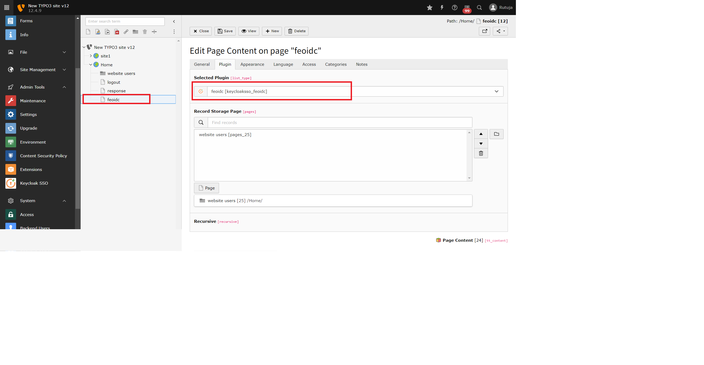
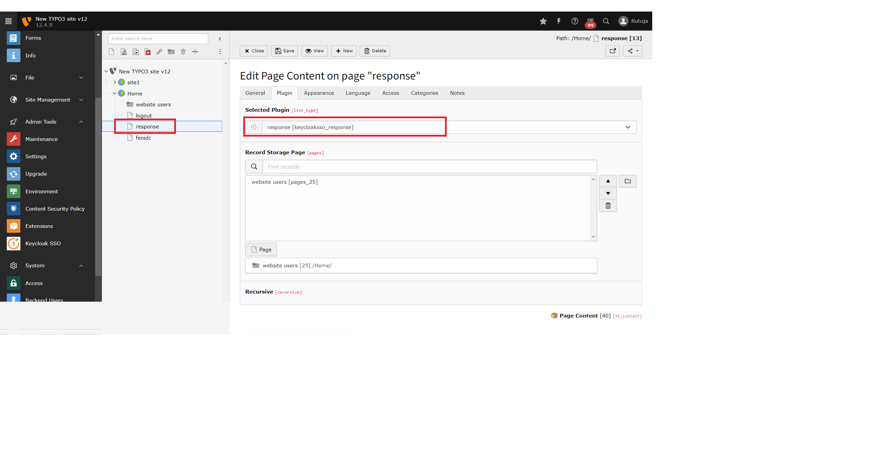

Installation
============

Extension Installation
**********************

Using composer:
---------------------

Use the below command to install the extension using composer:
composer req miniorange/keycloak_sso

OR 

Using zip file:
---------------------

Download the zip file of the Keycloak SSO extension from TYPO3 marketplace
Go to your TYPO3 backend, and click on Extensions section at the left side of your screen.
Upload the zip file as represented in the below image.

Prerequirements Before Configuring
**********************************

You must have atleast two pages before configuring the extension.

.. tip:: Pages can be created by the following steps:-

* Navigate to the Pages section and create new standard page with name feoidc and add feoidc plugin to it.
* Similarly create a page named response and and response plugin to it.
* You can refer to the below screenshots for the same.

* Create SSO Login button in your Typo3 Frontend Site and embed the feoidc page URL to it in order to initiate the SSO.

.. toctree::
	:maxdepth: 3
	:titlesonly:

	Configuration
